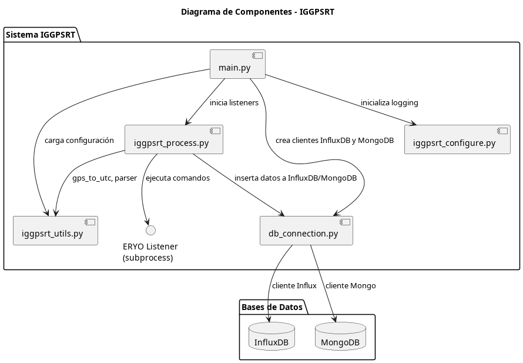
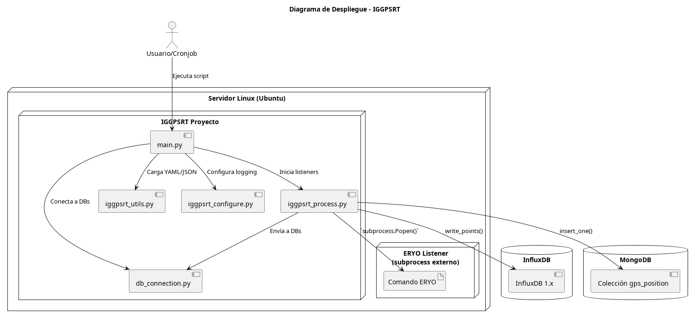
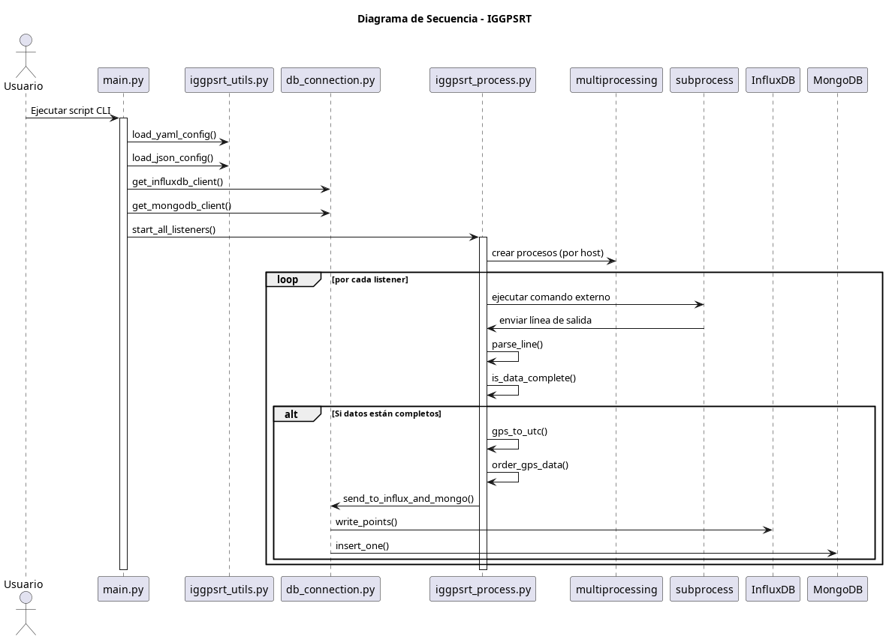

# IGGPSRT

**IGGPSRT** (IG GPS Real-Time) es un sistema diseñado para la **adquisición, procesamiento y almacenamiento automático de datos GPS en tiempo real** desde estaciones GNSS. El sistema ejecuta procesos externos (listeners), extrae y transforma la salida, y almacena los datos estructurados tanto en **InfluxDB** como en **MongoDB** para su visualización o análisis posterior.

---

## 🚀 ¿Qué hace este proyecto?

- Lee configuraciones desde archivos YAML y JSON.
- Inicia procesos externos (listeners) que recogen datos de estaciones GNSS.
- Extrae, valida y transforma datos como posición XYZ/ENU, número de satélites, y fecha GPS.
- Convierte la hora GPS a UTC.
- Inserta los datos en:
  - **InfluxDB**: para visualización de series de tiempo.
  - **MongoDB**: para almacenamiento estructurado y flexible.
- Usa `multiprocessing` para manejar múltiples estaciones/listeners en paralelo.

---


## Installation

```bash

$ conda create -n iggpsrt python=3.11
$ conda activate iggpsrt
$ conda install influxdb
$ conda install pyyaml
```


## 🧩 Diagrama de Componentes

Muestra cómo se estructuran los módulos internos del sistema.



---

## 🖥️ Diagrama de Despliegue

Muestra dónde se ejecuta cada parte del sistema y cómo se conectan entre sí.



---

## 🔄 Diagrama de Secuencia

Describe el flujo de ejecución desde el inicio del script hasta la inserción de datos en las bases de datos.



---


